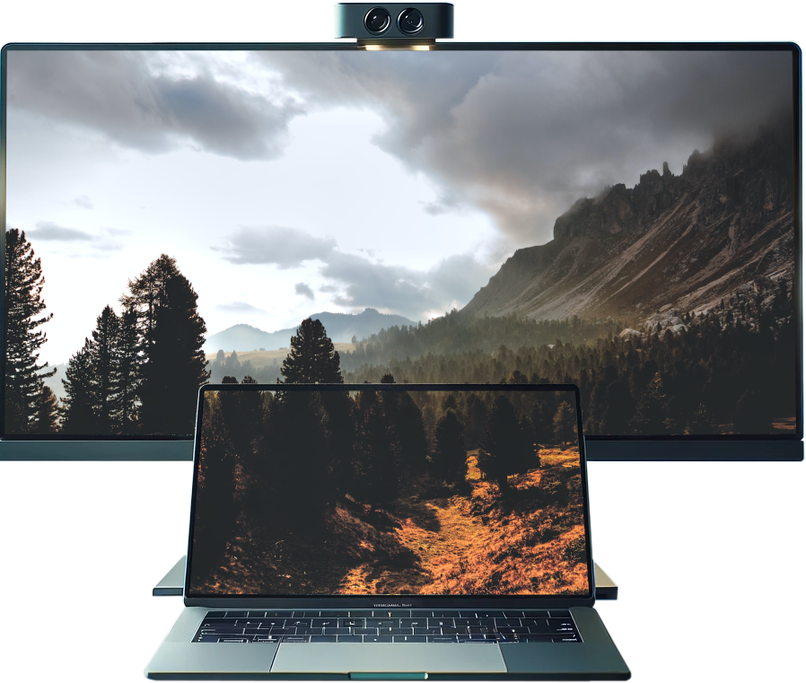

# MonitorMouseMapper

## Introduction

Make your multi-monitor life easier with **MonitorMouseMapper**! This Python-based utility eliminates the hassle of dealing with different monitor resolutions and DPIs. Designed specifically for setups where you have a high-DPI laptop monitor centered below a larger, lower-DPI external monitor.

## 🔥 Highlight: DPI Scaling Management

The core functionality of **MonitorMouseMapper** is to handle DPI scaling issues seamlessly as you move your mouse pointer between monitors with different DPIs. No more awkward jumps or stutters!

## Features

- 🖥️ **Automatic Monitor Detection**: No need for manual configuration. Automatically detects your monitors.
- 🖱️ **Smart Mouse Positioning**: Ensures your mouse moves smoothly between your top and bottom monitors.
- ⚙️ **Configuration File**: Customize your experience through a simple JSON config file.
- 🔄 **Dynamic Reconfiguration**: Automatically adapts when you connect or disconnect monitors.

## Installation

1. Clone the repository: 
    ```bash
    git clone https://github.com/yourusername/MonitorMouseMapper.git
    ```
2. Navigate to the project folder:
    ```bash
    cd MonitorMouseMapper
    ```
3. Run the script:
    ```bash
    python3 MonitorMouseMapper.py
    ```

## How to Use

1. **Initial Run**: Upon first launch, you'll be prompted to choose your top and bottom monitors and enter their widths in cm.
2. **Run and Forget**: Once set up, **MonitorMouseMapper** takes care of everything automatically.

## Example Setup

Imagine you have a smaller, high-DPI laptop monitor centered below a larger, low-DPI external monitor. With **MonitorMouseMapper**, not only will your mouse pointer transition smoothly between these two, but it'll also handle the DPI scaling intelligently.

## Requirements

- Python 3.x
- `pynput` library
- `xrandr` utility
- 🐧 **Ubuntu Support**: Currently, this utility only supports Ubuntu.

## Run at Startup

To run **MonitorMouseMapper** at startup, add the following command to your startup applications:

```bash
bash -c "sleep 5 && python3 /home/flo/Programs/MonitorMouseMapper/MonitorMouseMapper.py"
```
The delay is necessary to ensure that the script runs after your monitors have been detected. Adjust it to your machine's speed.

## Create desktop shortcut

To create a shortcut, make the create_desktop_shortcut.sh script executable and run it:

```bash
chmod +x create_desktop_shortcut.sh
./create_desktop_shortcut.sh
```
Choose between hills and tree icons:


## Troubleshooting

- Make sure `xrandr` is installed and updated.
- For a clean slate, you can delete the `config.json` file and re-run the script.

## Contribution

Contributions are welcome! Feel free to fork the project, submit pull requests, or raise issues.

## License

This project is licensed under the MIT license.

---

Simplify your multi-monitor setup with **MonitorMouseMapper**. Say goodbye to annoying DPI issues and hello to a smoother multi-monitor experience! 🌟
